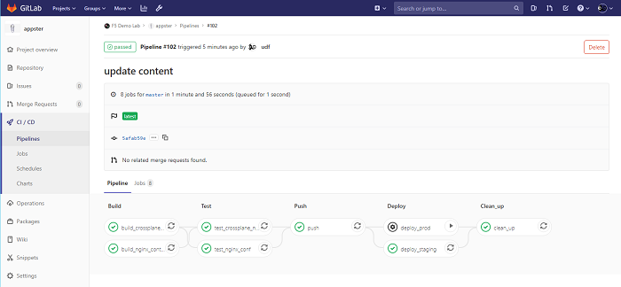
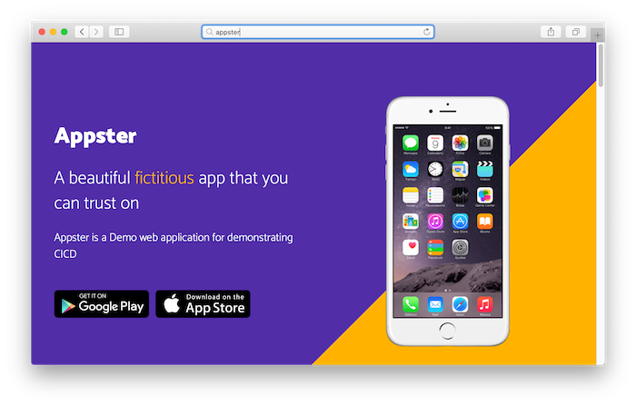

# Appster Web Server



A CICD demo for [NGINX Plus](https://www.nginx.com/products/nginx/) **web server**.

#### Requirements

1. **Just add [licenses](https://www.nginx.com/free-trial-request/)**
2. Continuous Integration: Setup a [Gitlab CICD]((https://docs.gitlab.com/ee/ci/quick_start/)) continuous integration service
3. A Linux build server with a [Gitlab Runner](https://docs.gitlab.com/ee/ci/runners/README.html), running Dind (Docker in Docker)
4. Docker images for [NGINX Plus](https://www.nginx.com/blog/deploying-nginx-nginx-plus-docker/) and [Crossplane](https://github.com/nginxinc/crossplane), readily available in a [Gitlab Container Registry](https://docs.gitlab.com/ee/user/packages/container_registry/)
5. *Optional:* Continuous Deployment: One or more ("Staging" and "Production") Linux docker host

#### Other setup Instructions:
 1. Place `nginx-repo.crt` and `nginx-repo.crt` files following files as Gitlab Variables
    * Retrieve your NGINX Plus Key and Certificate from the NGINX [customer portal](https://cs.nginx.com/) or from an activated evaluation
 2. Automate a [CICD pipeline using gitlab](https://docs.gitlab.com/ee/ci/pipelines.html). A example gitlab CI/CD pipeline file (`.gitlab-ci.yml`) is provided.
 3. Optional: Modify the `Dockerfile` as necessary, e.g. To install addtional NGINX Plus [Dynamic modules](https://docs.nginx.com/nginx/admin-guide/dynamic-modules/dynamic-modules/)

## Demos

SEE LAB GUIDE FOR DETAILED INSTRUCTIONS

### 1. Continuous Integration

#### Update our source repository and automaticly run our pipeline

1. Clone repo to local machine
2. Demonstrate a configuration change in the NGINX config or change in the Web App: 

##### Example 1. Update / revert phone image

1. Search and replace `iphone_7.png` with `iphone_x.png`. Change and revert as needed:

```bash
# This works with both GNU and BSD versions of sed:

# replace iphone 7 image to iphone x
sed -i '' 's/iphone_7.png/iphone_x.png/g' etc/nginx/html/index.html

# replace iphone x image to iphone 7
sed -i '' 's/iphone_x.png/iphone_7.png/g' etc/nginx/html/index.html
```

2. Commit and push changes to code repository:

```bash
git add .; git commit -m "changed phone image"; git push origin master
```

3. Watch the build process in realtime on [Gitlab](https://docs.gitlab.com/ee/ci/quick_start/)

4. Check out the changes in a web browser. **Tip:** You may need to clear browser cache or load in a private window


##### Example 2. Update / revert background image

1. Search and replace `#ffb300` with `#512DA8`. Change and revert as needed:

```bash
# This works with both GNU and BSD versions of sed:

# Flip background colors - yellow to purple, purple to yellow
sed -i '' 's/background:linear-gradient(-45deg,#ffb300 33%,transparent 0),linear-gradient(-45deg,#512da8/background:linear-gradient(-45deg,#512da8 33%,transparent 0),linear-gradient(-45deg,#ffb300/g' etc/nginx/html/css/bootstrap.min.css

# Flip background colors - purple to yellow, yellow to purple
sed -i '' 's/background:linear-gradient(-45deg,#512da8 33%,transparent 0),linear-gradient(-45deg,#ffb300/background:linear-gradient(-45deg,#ffb300 33%,transparent 0),linear-gradient(-45deg,#512da8/g' etc/nginx/html/css/bootstrap.min.css
```

2. Commit and push changes to code repository:

```bash
git add .; git commit -m "changed background image"; git push origin master
```

3. Watch the build process in realtime on [Gitlab](https://docs.gitlab.com/ee/ci/quick_start/)

4. Check out the changes in a web browser. **Tip:** You may need to clear browser cache or load in a private window




### 2. Continuous Deployment

We will automatically deploy to Staging but wait for a human trigger to deploy to Production

See` deploy_staging` and `deploy_prod` stages in our CICD file, `.gitlab-ci.yml`

